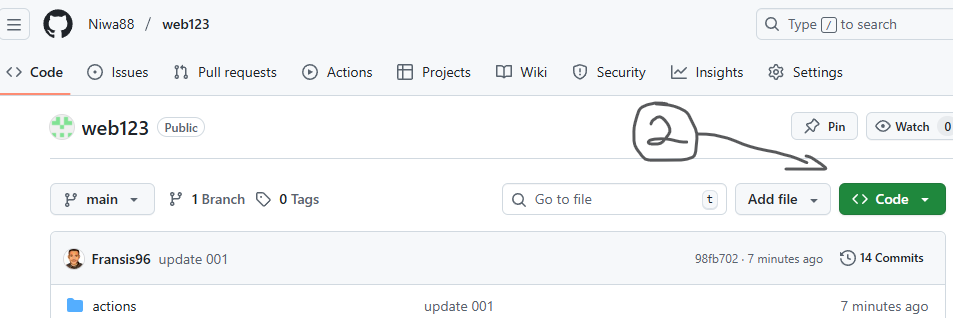
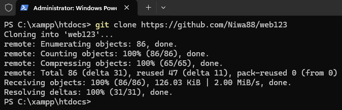

# web123


Aplikasi web ini merupakan contoh sederhana untuk pemula "*seperti saya*" dalam memahami sesi login/registrasi dan rule.  
> [!NOTE]  
> ***Tidak ditujukan untuk kaum menengah keatas***!

---

## 👨🏽‍💻 Terkait Project  
Ini merupakan project pemula dalam mempelajari:
  - Database "*MenggunakanSQL*"
  - register/login
  - proteksi halaman
  - role-based rules.

Semua pakai PHP (PDO) + MySQL, HTML polos (sesuai dengan yang saya "pemilik" tetapkan sendiri).

---

## Cara gunakan

### 1. Download Zip
  - Kunjungi link repo 👉 https://github.com/Niwa88/web123/
  - Pada halaman repo, pilih `<> Code` lalu `Download ZIP` seperti pada gambar berikut:
<ul></ul>
    
### 2. Cloning
  - Copy perintah berikut dan jalankan di cmd / powershell "*Windows*":
    ```Git
    git clone https://github.com/Niwa88/web123
    ```  
<ul></ul>  

> [!NOTE]   
> ***Git wajib terinstall*** 

### Jalankan di lokal
Jika menggunakan XAMPP maka:
- nyalakan Apache dan MySQL
- letakan path project hasil clonningan di htdocs
- import database `db_users`
  > pastikan sudah buat database dengan nama yang sama!
- pada browser, kunjungi ``http://localhost/web123/`` "defaultnya" 

### Informasi Users:
  - Admin :
  - **nip**: `00001`
  - **password**: `admin`
    
- User :
  - **nip**: `11110`
  - **password**: `123Enter`
